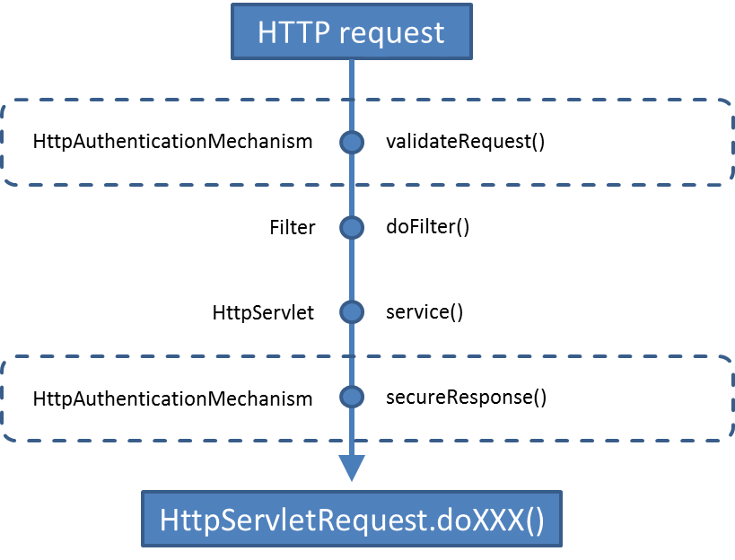

# Soteria + JWT

## Soteria

Soteria (Java EE Security (JSR 375) RI) bietet eine einheitliche Schnittstelle für das
Absichern von REST Resourcen, JSF Seiten, Forms, ...

### Aufgabe
- Authentification: 
- Authorization: 

### Grundklassen und Ablauf
 - Credential: Authorisierungsdaten (Benutzernamen, Passwörter, Rollen, JWTs, andere Tokens, ...)
 - Identity Store: validiert Credentials
 - Authentication Mechanism: liest Daten aus dem Request, gibt diese an den Identity Store
 weiter und gibt dem Container über das Ergebnis bescheid.

## JWT

"JSON Web Tokens are an open, industry standard RFC 7519 method for representing claims securely between two parties."

### Aufgabe
 - Rollen und andere Daten im HTTP Header zu verschicken
 - Diese Daten für 3te unveränderbar machen
 - Datenintegrität

### Grundideen und Aufbau

 - Hash Funktionen
 - Secret Keys
 - HMAC
 

## Beispiel

### Beschreibung

Eine Javaee Applikation die das einloggen mittels Username und Passwort erlaubt. Darauf hin wird ein
JWT generiert und an den Client gesendet. Dieser kann damit auf die abgesicherten Endpoints zugreifen.
Das ganze wird anhand eines Online Shops dargestellt.

### Aufbau
### webapp > WEB-INF
 - web.xml : Konfiguriert, welche Pfade vom Auth Mechanismus überprüft werden (Leider nicht via Code möglich)
 - jboss-web.xml : Konfiguriert die Security Domaine (Leider nicht via Code möglich, vom Application Server abhängig)
#### business
 - UserRepository : Mock für ein Repository, dass auf eine Datenbank zugreift
#### entities
 - User : Ein registrierter Nutzer im Online Shop
 - Customer : Ein Nutzer, der auf der Platform einkaufen kann
 - Salesman : Ein Nutzer, der auf der Platform verkaufen kann
#### rest
 - RestConfig : Konfiguriert REST Path und Rollen
##### endpoints
 - LoginEndpoint : Ein Endpoint, auf den jeder zugreifen kann. Hier kann man sich mittels POST anmelden.
 - ProtectedEndpoint : Ein Endpoint mit Methoden, auf die nur gewisse Rollen zugreifen können.
##### security
 - JWTCredential : Entität zum Speichern eines JWT. (Erbt von Soteria's Credential)
 - JWTMechanism : Fängt alle Request ab und versucht den JWT aus dem HTTP Header auszulesen und mithilfe des JWTStore zu validieren
 - JWTStore : Validiert JWT Credentials und stellt diese aus.
 - Role : Klasse in der alle möglichen Rollen des Systems gespeichert sind (Salesman und Customer)
 
### Zugriffe
####http://localhost:8080/JWT/login
 - POST
 - { "username": "Max Mustermann", "password": "12345" }
 - liefert im Response Authentification Header den generierten JWT. (falls erfolgreich)
 
####http://localhost:8080/JWT/protected
 - GET
 - liefert ein OK, sofern im Authentification Header ein valider JWT mit den Rollen User oder Salesman steht
 
####http://localhost:8080/JWT/protected/customer
  - GET
  - liefert ein OK, sofern im Authentification Header ein valider JWT mit der Rolle User steht
  
####http://localhost:8080/JWT/protected/customer
  - GET
  - liefert ein OK, sofern im Authentification Header ein valider JWT mit der Rolle Salesman steht